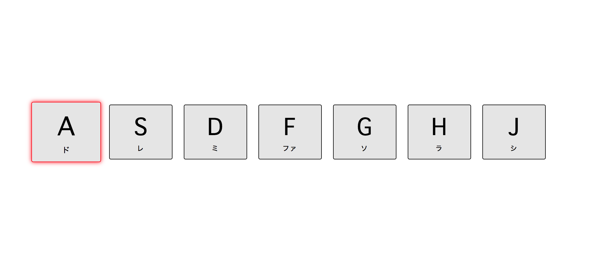

# チャレンジ5

```
所要時間: 30分
ステータス: ドラフト
タイプ: 課題
```

## 目的

- イベントの基本的な構造を理解する。
- 基本的なイベントを使えるようになる。

## チャレンジの取り組み方

1. マイルストーンごとに要件に合うようにファイルを編集していきます。
2. 分からない部分があれば、テキストを復習して、再度チャレンジしてみましょう。
3. 再チャレンジしてしばらく考えても分からない場合はチャットでメンターに質問しましょう。
4. 完成したら、Dropboxでメンターとファイルを共有して下さい。
5. メンターから課題レビューが届きます。
6. ビデオチャットの際は、分からない点を更に突っ込んで聞いたり、より良い書き方を聞いてみましょう。

## 概要
レッスン５ではクリックで発動するスタイルのON/OFFボタンを実装しました。
今度は他の種類のイベントを利用して、ブラウザの画面上で特定のキーボードを押すと音がなるピアノを作ってみましょう。

### アプリケーション画面



## スターターファイル

自分のパソコン上に、challenge5というフォルダを作って、その中に`index.html` `styles.css` 、 `main.js` というファイルをそれぞれ作成しましょう。それぞれのファイルには以下のスターターファイルの内容をコピーして下さい。

- [codegrit-js-unit01-ch05-starter](https://github.com/codegrit-jp-students/codegrit-js-unit01-ch05-starter)

## マイルストーン１

### 要件

- イベントを利用して、キーボードを押すと音がなるピアノを作る
- `playing` と言うClass属性をDOMを使って追加する
- data属性を使用して、特定のキーを押すためのkeyCodeを取得する
- `classList` に `add` と `remove` のメソッドを用いる
- `transitionend` と `keydown` のイベントを使用する

## 評価

課題の後、以下の２つについてメンターにフィードバックをお願いします。

1. 要件のカバー度: 1.全く出来なかった 2.ほとんど出来なかった 3. 半分ほどは出来た 4.8割ほどは出来た 5. 全部出来た
2. 難易度: 1. とても難しかった 2. 難しかった 3. ちょうど良かった 4. 簡単だった 5. とても簡単だった
