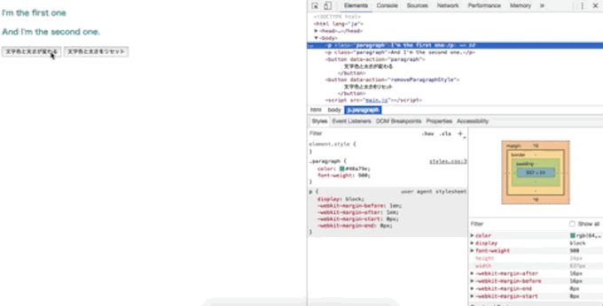

## イベントとは

イベントとは、レッスン4で学んだDOMとDOM APIと合わせて使うことが多く、マウスのクリック、キーボードへの入力や、タッチ、ブラウザの拡大や縮小など、document(ブラウザ)に対してユーザーが行う様々なアクションのことを指します。

レッスン4の終わりでは`addStyle`と言うCSSセレクタのある要素全てに、テキストにスタイルを付けたり外したりするボタンを実装し、data属性を呼び出しました。

この状態ではボタンは機能がないので、実際にクリックすることでスタイルを付けたりリセットしたりできる機能、つまり「イベント」を実装していきましょう。

## clickイベント

もっともメジャーなイベントが**clickイベント**です。
特にレッスン4から作成している機能自体もボタンなので、クリックを着火剤（**trigger**と言います）としてイベントを発動（**fire**と言います）させることに利用します。

現在の状態は、ボタンと`addStyle`と言う関数はまだ紐づいていない状態で、イベントで結びつける必要があります。

```html
<p>I'm the first one.</p>
<p>And I'm the second one.</p>

<button data-action="addStyle">
  文字色と太さが変わる
</button>
<button data-action="resetStyle">
  文字色と太さをリセット
</button>
```

```css
.paragraph {
  color: #40a79e;
  font-weight: 900;
}
```

```js
////// レッスン４で実装した箇所 //////

// スタイルを付与するための関数
function paragraphColor() {
  const paraColor = document.getElementsByTagName('p');
  for (let p of paraColor) {
    p.classList.add('paragraph'); // クラスを加える
  }
}

// スタイルリセット関数
function paragraphReset() {
  const paraColor = document.getElementsByTagName('p');
  for (let p of paraColor) {
    p.classList.remove('paragraph'); // クラスを取り除く
  }
}

////// 今回実装した箇所 //////
// スタイル追加ボタン
const paragraphAction = document.querySelectorAll('[data-action="addStyle"]');

for (let button of paragraphAction) {
  button.addEventListener('click', evt => {
    evt.preventDefault();
    paragraphColor(); // 上記関数の呼び出し
  });
}

// スタイルリセットボタン
const paragraphResetAction = document.querySelectorAll('[data-action="resetStyle"]');

for (let button of paragraphResetAction) {
  button.addEventListener('click', evt => {
    evt.preventDefault();
    paragraphReset(); // 上記関数の呼び出し
  });
}
```



<iframe width="100%" height="300" src="//jsfiddle.net/codegrit_hiro/qg9eojvu/1/embedded/js,html,css,result/dark/" allowfullscreen="allowfullscreen" allowpaymentrequest frameborder="0"></iframe>

`addEventListener`は全ての要素が持っているメソッドで、イベントが起こった時に呼ぶ関数を指定する役割を持ちます。
イベントを実装することによって、HTMLやCSSを書き換えるだけでコンテンツが変化しても機能を保つ事ができるようになります。

## キャプチャリングとバブリング

イベントが起こる順序として、もっとも上にいるノードからターゲット要素（上記の例で言うbutton）へ階層を下がっていって処理する**キャプチャリング**と、その逆の**バブリング**があります。
イベントがどの方向で伝達されるのかと言うことを理解しておくと、上記のコードで言う`preventDefault`の意味がわかるようになります。

`preventDefault`は、イベントを中止する役割をします。
イベントを中止すると言うと、上記の例でイベントを実装したのに中止するようで混乱しがちなのですが、実装を意図しているイベントを中止すると言うよりも、それ以外にあらかじめ「初期設定としてついているイベントを打ち消す役割」とイメージするとわかりやすいかもしれません。

この他にもあと2つ似た役割をするものがあるので、表でわかりやすくまとめて見てみましょう。

| 設定 | 内容 |
| -------- | -------- |
| preventDefault | 初期設定としてついているイベントを打ち消す役割。キャンセルされたイベント自体は伝達されるが実行されない。 |
| stopPropagation | イベント対象の要素を超えてのイベント伝達はしない。 |
| stopImmediatePropagation | どんなイベントであっても呼ばれない。 |

## よく使うイベント一覧

| イベント | 内容 |
| -------- | -------- |
| drag | ドラッグ&ドロップの操作を実現 |
| submit | フォームに対するsubmitイベントを実現 |
| mousedown | マウスイベント |
| mousemove | マウスイベント |
| mouseup | マウスイベント |
| mouseenter | マウスイベント |
| mouseleave | マウスイベント |
| mouseover | マウスイベント |
| mousewheel | マウスイベント |
| keydown | キーボードイベント |
| keypress | キーボードイベント |
| keyup | キーボードイベント |
| pause | 映像メディアイベント |
| play | 映像メディアイベント |
| load | プログレスイベント |
| error | プログレスイベント |
| touches | タッチイベント（ピンチ、スワイプなどの複数の同時タッチ認識が可能） |

この他にもイベント一覧はMDNに一覧があるので、必要に応じて参照してください。

[サンプルコード](https://github.com/codegrit-jp-students/codegrit-js-unit01-lesson05-samples/tree/master/click-event)

## 更に学ぼう

### 動画で学ぶ

- [JavaScript入門 - ドットインストール](https://dotinstall.com/lessons/basic_javascript_v2)

### 本で学ぶ

- [Eloquent JavaScript 3rd Edition](http://eloquentjavascript.net/)